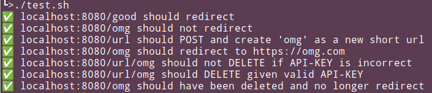

# Flask CRUD App

This is a simple Flask app that provides CRUD (Create, Read, Update, Delete) endpoints. It also includes bash shell tests to ensure the functionality of the app.

## Usage

1. Start the Flask app:

  ```bash
  python flask_shell.py
  ```

2. This starts the server on  `http://localhost:8080`.  You can hit the API end points with your browser, postman, or curl (which we'll use here for testing).

## Endpoints

- `GET /url/<short_code>`: Get the url for this short code.
- `POST /url/<short_code>`: Create a new short short code by passing a JSON object in the body with keys `url` and `code`
- `DELETE /url/<short_code>`: Delete the cached url for this short code.
- `GET /<short_code>`: Navigate (redirect) to the url assoicated with this short code.


## Tests

Run `test.sh` to run the tests.


The output should look something like this.


